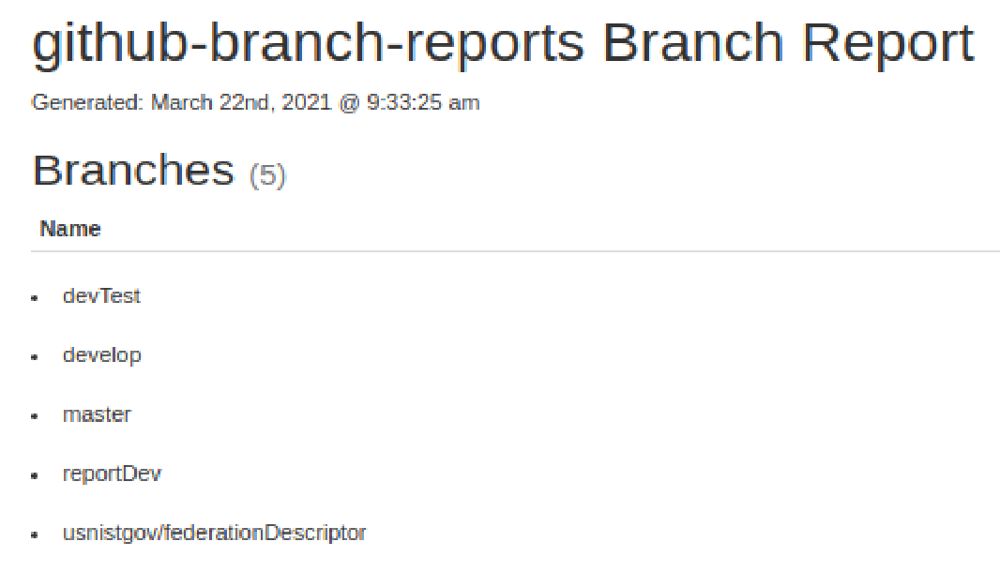

## Purpose

This simple little tool generates a static HTML report of the name of branches for a Github repo. This is useful if you want to share
the entire brunch list with someone who doesn't have access to your repo, for example.

## Getting Started

1. Install `npm install -g github-branch-reports`
2. Run `github-branch-reports -o <owner> -r <repo> [-t <access token>]` (access token is required to access private repos)

[Creating an access token](https://help.github.com/articles/creating-an-access-token-for-command-line-use/)

## Sample Report

## Steps
Goto github-branch-reports  
[github-branch-reports]$ npm install -g ( -g is for global)  
[github-branch-reports]$ github-branch-reports   
Usage: github-branch-reports -o <owner> -r <repo> [-t <token>]  
e.g. [github-branch-reports]$ github-branch-reports -o usnistgov -r github-branch-reports  
